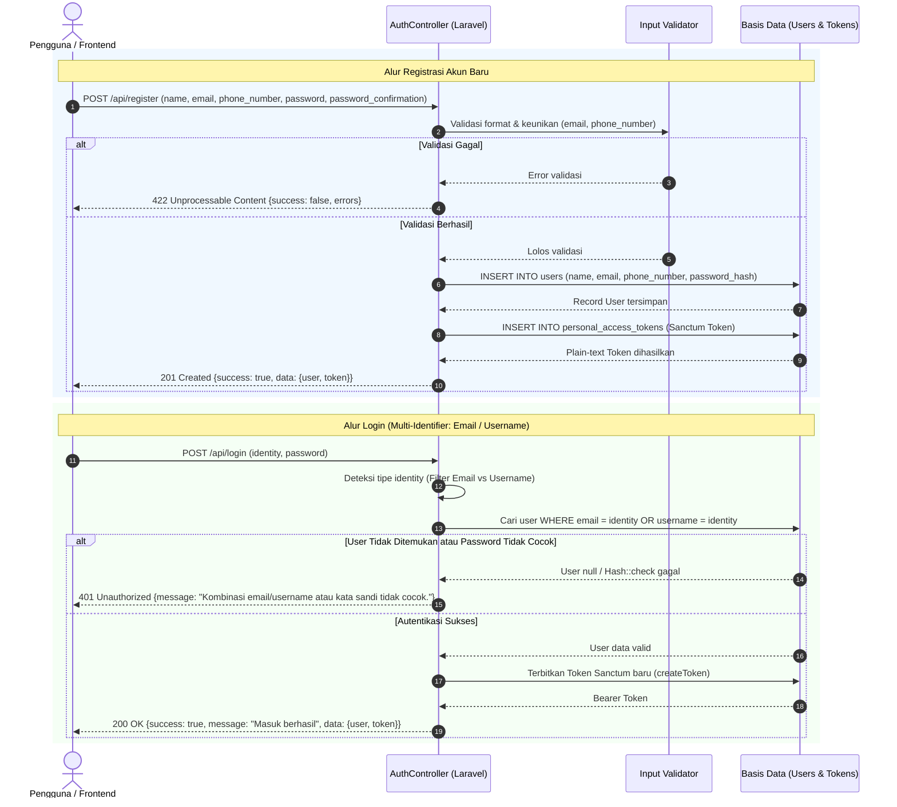
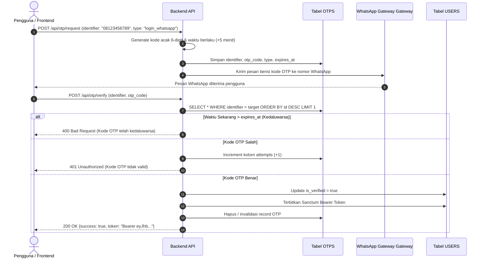

# 🚀 Layanan Autentikasi & Manajemen Pengguna (Tugas UKL 2)

Aplikasi backend API berbasis **Laravel 12** dan **PHP 8.4** yang menyediakan sistem autentikasi modern, fleksibel, dan aman. Mendukung multi-identitas login (Email dan Username), pendaftaran nomor WhatsApp/telepon, sistem proteksi verifikasi OTP (One-Time Password) dengan pembatasan kedaluwarsa serta percobaan (*brute-force prevention*), manajemen sesi database, dan API Token berbasis **Laravel Sanctum**.

---

## 📑 Daftar Isi

- [Arsitektur & Tech Stack](#-arsitektur--tech-stack)
- [Desain Database & Entity Relationship Diagram (ERD)](#-desain-database--entity-relationship-diagram-erd)
  - [Diagram ERD (Mermaid)](#diagram-erd-mermaid)
  - [Kamus Data (Data Dictionary)](#kamus-data-data-dictionary)
- [Diagram Alur Sistem (Sequence Diagram)](#-diagram-alur-sistem-sequence-diagram)
  - [1. Alur Registrasi & Login (Email/Username)](#1-alur-registrasi--login-emailusername)
  - [2. Alur Autentikasi OTP WhatsApp](#2-alur-autentikasi-otp-whatsapp)
- [Dokumentasi API Endpoint](#-dokumentasi-api-endpoint)
- [Panduan Instalasi & Menjalankan Proyek](#-panduan-instalasi--menjalankan-proyek)
- [Pengujian (Testing)](#-pengujian-testing)

---

## 🛠 Arsitektur & Tech Stack

| Komponen | Teknologi | Keterangan |
| :--- | :--- | :--- |
| **Bahasa Pemrograman** | PHP 8.4 | Fitur modern PHP (Constructor promotion, typed properties, match expressions) |
| **Framework Backend** | Laravel Framework 12 (v13.x) | Arsitektur MVC & RESTful API |
| **Autentikasi Token** | Laravel Sanctum 4.x | Bearer Token API polimorfik |
| **Database Engine** | SQLite (Default Dev) / MySQL / PostgreSQL | Relational Database Management System |
| **Session & Cache** | Database Driver | Manajemen sesi HTTP & cache terpusat |
| **Pengujian (Testing)** | Pest PHP 5.x & PHPUnit 13.x | Framework testing modern & ekspresif |

---

## 🗄 Desain Database & Entity Relationship Diagram (ERD)

Desain basis data dirancang secara terstandarisasi untuk mendukung fleksibilitas identitas pengguna (Email, Username, Nomor WhatsApp) serta keamanan token sesi dan verifikasi OTP.

### Diagram ERD (Mermaid)

```mermaid
erDiagram
    %% Entitas Utama dan Relasi
    USERS ||--o{ PERSONAL_ACCESS_TOKENS : "memiliki token API (polymorphic)"
    USERS ||--o{ SESSIONS : "memiliki riwayat sesi web"
    USERS ||--o{ OTPS : "diasosiasikan via identifier (telepon/email)"
    USERS ||--o{ PASSWORD_RESET_TOKENS : "memiliki permintaan reset via email"

    %% Relasi Tabel Sistem Pendukung
    JOB_BATCHES ||--o{ JOBS : "mengelompokkan eksekusi"

    %% Definisi Entitas USERS
    USERS {
        bigint id PK "Primary Key (Auto Increment)"
        varchar name "Nama Lengkap Pengguna"
        varchar email UK "Email unik pengguna (Nullable)"
        varchar username UK "Username unik pengguna (Nullable)"
        varchar phone_number UK "Nomor WhatsApp unik (Nullable)"
        varchar password "Hash kata sandi (Bcrypt/Argon2)"
        boolean is_verified "Status verifikasi akun (Default: false)"
        timestamp created_at "Waktu pembuatan record"
        timestamp updated_at "Waktu perubahan record"
    }

    %% Definisi Entitas PERSONAL_ACCESS_TOKENS (Sanctum)
    PERSONAL_ACCESS_TOKENS {
        bigint id PK "Primary Key (Auto Increment)"
        varchar tokenable_type "Model tujuan (App\\Models\\User)"
        bigint tokenable_id FK "ID referensi entitas pengguna"
        text name "Nama Token (misal: auth_token)"
        varchar token UK "Hash SHA-256 token rahasia (64 char)"
        text abilities "Hak akses / scope token (Nullable)"
        timestamp last_used_at "Waktu terakhir token digunakan"
        timestamp expires_at "Waktu kedaluwarsa token (Indexed)"
        timestamp created_at "Waktu pembuatan token"
        timestamp updated_at "Waktu pembaruan token"
    }

    %% Definisi Entitas OTPS
    OTPS {
        bigint id PK "Primary Key (Auto Increment)"
        varchar identifier "No Telepon atau Email penerima"
        varchar otp_code "Kode rahasia verifikasi (4-6 digit)"
        enum type "Tipe: login_whatsapp atau forgot_password"
        integer attempts "Jumlah percobaan gagal (Default: 0)"
        timestamp expires_at "Batas waktu berlaku kode OTP"
        timestamp created_at "Waktu pembuatan OTP"
        timestamp updated_at "Waktu pembaruan OTP"
    }

    %% Definisi Entitas PASSWORD_RESET_TOKENS
    PASSWORD_RESET_TOKENS {
        varchar email PK "Email tujuan reset kata sandi"
        varchar token "Hash token reset kata sandi"
        timestamp created_at "Waktu token di-generate"
    }

    %% Definisi Entitas SESSIONS
    SESSIONS {
        varchar id PK "ID unik sesi (Primary Key)"
        bigint user_id FK "Referensi ID pengguna (Nullable)"
        varchar ip_address "Alamat IP klien (IPv4 / IPv6, max 45)"
        text user_agent "Informasi browser dan perangkat klien"
        longtext payload "Data terenkripsi / ter-serialize sesi"
        integer last_activity "Unix timestamp aktivitas terakhir"
    }

    %% Definisi Entitas JOBS (Queue Worker)
    JOBS {
        bigint id PK "Primary Key (Auto Increment)"
        varchar queue "Nama antrean antrian kerja"
        longtext payload "Payload serialisasi tugas (Job class & data)"
        tinyint attempts "Jumlah percobaan eksekusi"
        integer reserved_at "Waktu tugas dicadangkan worker"
        integer available_at "Waktu tugas siap dijalankan"
        integer created_at "Waktu tugas masuk ke antrean"
    }

    %% Definisi Entitas JOB_BATCHES
    JOB_BATCHES {
        varchar id PK "UUID unik kumpulan antrean"
        varchar name "Nama pengelompokan batch antrean"
        integer total_jobs "Total jumlah job dalam batch"
        integer pending_jobs "Sisa job yang belum diproses"
        integer failed_jobs "Jumlah job yang mengalami kegagalan"
        longtext failed_job_ids "Array ID job yang gagal dieksekusi"
        mediumtext options "Konfigurasi callback batch (serialized)"
        integer cancelled_at "Waktu pembatalan batch"
        integer created_at "Waktu pembuatan batch"
        integer finished_at "Waktu penyelesaian batch"
    }

    %% Definisi Entitas FAILED_JOBS
    FAILED_JOBS {
        bigint id PK "Primary Key (Auto Increment)"
        varchar uuid UK "UUID unik rekaman kegagalan"
        text connection "Koneksi database/queue yang digunakan"
        text queue "Nama antrean yang gagal"
        longtext payload "Data payload job yang gagal"
        longtext exception "Trace pesan error atau exception"
        timestamp failed_at "Waktu kegagalan terjadi"
    }

    %% Definisi Entitas CACHE
    CACHE {
        varchar key PK "Kunci data cache unik"
        mediumtext value "Nilai data yang disimpan"
        integer expiration "Waktu kedaluwarsa (Unix timestamp)"
    }
```



---

### Kamus Data (Data Dictionary)

Berikut adalah rincian struktur kolom, tipe data, serta aturan kendala (*constraints*) untuk setiap tabel pada basis data:

#### 1. Tabel `users`
Tabel utama untuk menyimpan kredensial dan informasi profil pengguna.

| Kolom | Tipe Data | Nullable | Key / Constraint | Default | Deskripsi Bisnis |
| :--- | :--- | :---: | :---: | :---: | :--- |
| `id` | `BIGINT UNSIGNED` | Tidak | **PK** (Auto Inc) | - | Identifier unik pengguna |
| `name` | `VARCHAR(255)` | Tidak | - | - | Nama lengkap pengguna |
| `email` | `VARCHAR(255)` | Ya | **UNIQUE** | `NULL` | Alamat surel (login & notifikasi) |
| `username` | `VARCHAR(255)` | Ya | **UNIQUE** | `NULL` | Nama pengguna unik untuk opsi login |
| `phone_number` | `VARCHAR(255)` | Ya | **UNIQUE** | `NULL` | Nomor telepon/WhatsApp untuk registrasi & OTP |
| `password` | `VARCHAR(255)` | Ya | - | `NULL` | Hash kata sandi terenkripsi (Bcrypt) |
| `is_verified` | `BOOLEAN` | Tidak | - | `false` | Menandakan apakah kontak/email telah diverifikasi |
| `created_at` | `TIMESTAMP` | Ya | - | `NULL` | Waktu akun didaftarkan |
| `updated_at` | `TIMESTAMP` | Ya | - | `NULL` | Waktu akun terakhir diperbarui |

#### 2. Tabel `otps`
Tabel penampung kode One-Time Password untuk login berbasis WhatsApp dan pemulihan kata sandi.

| Kolom | Tipe Data | Nullable | Key / Constraint | Default | Deskripsi Bisnis |
| :--- | :--- | :---: | :---: | :---: | :--- |
| `id` | `BIGINT UNSIGNED` | Tidak | **PK** (Auto Inc) | - | Identifier unik entri OTP |
| `identifier` | `VARCHAR(255)` | Tidak | Index | - | Target penerima (No WhatsApp / Email) |
| `otp_code` | `VARCHAR(255)` | Tidak | - | - | Kode OTP 4–6 digit (terenkripsi / acak) |
| `type` | `ENUM` | Tidak | - | - | Jenis aksi: `'login_whatsapp'` atau `'forgot_password'` |
| `attempts` | `INTEGER` | Tidak | - | `0` | Jumlah salah input (pencegahan *brute-force*) |
| `expires_at` | `TIMESTAMP` | Tidak | Index | - | Batas kedaluwarsa waktu toleransi kode OTP |
| `created_at` | `TIMESTAMP` | Ya | - | `NULL` | Waktu OTP digenerate |
| `updated_at` | `TIMESTAMP` | Ya | - | `NULL` | Waktu pembaruan status OTP |

#### 3. Tabel `personal_access_tokens` (Laravel Sanctum)
Tabel untuk mengelola token API otentikasi Bearer Token berbasis polimorfisme Eloquent.

| Kolom | Tipe Data | Nullable | Key / Constraint | Default | Deskripsi Bisnis |
| :--- | :--- | :---: | :---: | :---: | :--- |
| `id` | `BIGINT UNSIGNED` | Tidak | **PK** (Auto Inc) | - | Identifier unik token |
| `tokenable_type` | `VARCHAR(255)` | Tidak | Morph Index | - | Nama model pemilik (misal: `App\Models\User`) |
| `tokenable_id` | `BIGINT UNSIGNED` | Tidak | Morph Index | - | ID model pemilik (merujuk ke `users.id`) |
| `name` | `TEXT` | Tidak | - | - | Label nama token (misal: `'auth_token'`) |
| `token` | `VARCHAR(64)` | Tidak | **UNIQUE** | - | Hash SHA-256 dari plain token |
| `abilities` | `TEXT` | Ya | - | `NULL` | Array izin / hak akses token |
| `last_used_at` | `TIMESTAMP` | Ya | - | `NULL` | Terakhir kali token digunakan memanggil API |
| `expires_at` | `TIMESTAMP` | Ya | Index | `NULL` | Batas kedaluwarsa masa aktif token |
| `created_at` | `TIMESTAMP` | Ya | - | `NULL` | Waktu token dibuat |
| `updated_at` | `TIMESTAMP` | Ya | - | `NULL` | Waktu status token diubah |

#### 4. Tabel `password_reset_tokens`
Tabel untuk menyimpan token verifikasi pergantian/reset kata sandi.

| Kolom | Tipe Data | Nullable | Key / Constraint | Default | Deskripsi Bisnis |
| :--- | :--- | :---: | :---: | :---: | :--- |
| `email` | `VARCHAR(255)` | Tidak | **PK** | - | Alamat email pemohon reset sandi |
| `token` | `VARCHAR(255)` | Tidak | - | - | Token acak terenkripsi |
| `created_at` | `TIMESTAMP` | Ya | - | `NULL` | Waktu token reset digenerate |

#### 5. Tabel `sessions`
Tabel session driver terpusat untuk menyimpan status sesi login web secara aman di database.

| Kolom | Tipe Data | Nullable | Key / Constraint | Default | Deskripsi Bisnis |
| :--- | :--- | :---: | :---: | :---: | :--- |
| `id` | `VARCHAR(255)` | Tidak | **PK** | - | Session ID unik dari cookie pengguna |
| `user_id` | `BIGINT UNSIGNED` | Ya | Index / FK | `NULL` | ID pengguna login (merujuk ke `users.id`) |
| `ip_address` | `VARCHAR(45)` | Ya | - | `NULL` | IP address klien saat terhubung |
| `user_agent` | `TEXT` | Ya | - | `NULL` | Browser dan Sistem Operasi klien |
| `payload` | `LONGTEXT` | Tidak | - | - | Isi state sesi terenkripsi |
| `last_activity` | `INTEGER` | Tidak | Index | - | Timestamp UNIX aktivitas terkini |

---

## 🔄 Diagram Alur Sistem (Sequence Diagram)

### 1. Alur Registrasi & Login (Email/Username)

Pengguna dapat mendaftar dengan akun baru, serta melakukan login menggunakan **Email** ataupun **Username** secara dinamis:



### 2. Alur Autentikasi OTP WhatsApp

Verifikasi dua langkah atau *passwordless login* menggunakan pesan WhatsApp:



---

## 📡 Dokumentasi API Endpoint

Berikut adalah ringkasan endpoint yang tersedia di sistem:

### 1. Registrasi Akun Pengguna
- **URL**: `/api/register`
- **Method**: `POST`
- **Headers**: `Accept: application/json`, `Content-Type: application/json`
- **Payload Request**:
  ```json
  {
    "name": "Budi Santoso",
    "email": "budi@example.com",
    "phone_number": "081234567890",
    "password": "Password123!",
    "password_confirmation": "Password123!"
  }
  ```
- **Contoh Respons Sukses (201 Created)**:
  ```json
  {
    "success": true,
    "message": "Pendaftaran berhasil",
    "data": {
      "user": {
        "id": 1,
        "name": "Budi Santoso",
        "email": "budi@example.com",
        "phone_number": "081234567890",
        "created_at": "2026-10-07T06:55:00.000000Z",
        "updated_at": "2026-10-07T06:55:00.000000Z"
      },
      "token": "1|qXyZabcde12345..."
    }
  }
  ```

### 2. Login (Email atau Username)
- **URL**: `/api/login` (atau `loginEmail`)
- **Method**: `POST`
- **Headers**: `Accept: application/json`, `Content-Type: application/json`
- **Payload Request**:
  ```json
  {
    "identity": "budi@example.com",
    "password": "Password123!"
  }
  ```
  *(Catatan: Kolom `identity` dapat diisi email maupun username).*
- **Contoh Respons Sukses (200 OK)**:
  ```json
  {
    "success": true,
    "message": "Masuk berhasil",
    "data": {
      "user": {
        "id": 1,
        "name": "Budi Santoso",
        "email": "budi@example.com",
        "phone_number": "081234567890"
      },
      "token": "2|hIjkLmNoP67890..."
    }
  }
  ```

### 3. Profil Pengguna Terautentikasi
- **URL**: `/api/user`
- **Method**: `GET`
- **Headers**: `Accept: application/json`, `Authorization: Bearer <token>`
- **Contoh Respons Sukses (200 OK)**:
  ```json
  {
    "id": 1,
    "name": "Budi Santoso",
    "email": "budi@example.com",
    "phone_number": "081234567890",
    "is_verified": true
  }
  ```

---

## 💻 Panduan Instalasi & Menjalankan Proyek

### Prasyarat Sistem
- **PHP** versi `>= 8.3` atau `>= 8.4` dengan ekstensi (`pdo`, `sqlite3` atau `pdo_mysql`, `mbstring`, `openssl`).
- **Composer** versi `>= 2.x`.
- **Node.js** & **NPM** (opsional untuk asset frontend).

### Langkah-langkah Instalasi

1. **Clone Repositori**:
   ```bash
   git clone <url-repository> tugas-ukl2
   cd tugas-ukl2
   ```

2. **Instal Dependensi PHP**:
   ```bash
   composer install
   ```

3. **Konfigurasi Environment**:
   Salin file konfigurasi environment dan buat App Encryption Key:
   ```bash
   cp .env.example .env
   php artisan key:generate
   ```

4. **Konfigurasi Database**:
   Secara default, aplikasi menggunakan database **SQLite**. Buat berkas database lokal jika belum ada:
   ```bash
   touch database/database.sqlite
   ```
   *(Jika menggunakan MySQL, sesuaikan nilai `DB_CONNECTION=mysql`, `DB_HOST`, `DB_PORT`, `DB_DATABASE`, `DB_USERNAME`, dan `DB_PASSWORD` di berkas `.env`).*

5. **Jalankan Migrasi Database**:
   Jalankan migrasi untuk membuat seluruh tabel skema basis data:
   ```bash
   php artisan migrate
   ```

6. **Menjalankan Server Pengembangan**:
   Jalankan local development server:
   ```bash
   php artisan serve
   ```
   API kini dapat diakses melalui URL: `http://127.0.0.1:8000`.

---

## 🧪 Pengujian (Testing)

Proyek ini telah dikonfigurasi dengan framework pengujian modern **Pest PHP**:

Jalankan seluruh rangkaian pengujian fitur dan unit:
```bash
php artisan test --compact
```
Atau jalankan langsung melalui binary Pest:
```bash
vendor/bin/pest
```

---

## 📄 Lisensi

Proyek ini bersifat open-source dan dilisensikan di bawah lisensi [MIT License](LICENSE).
